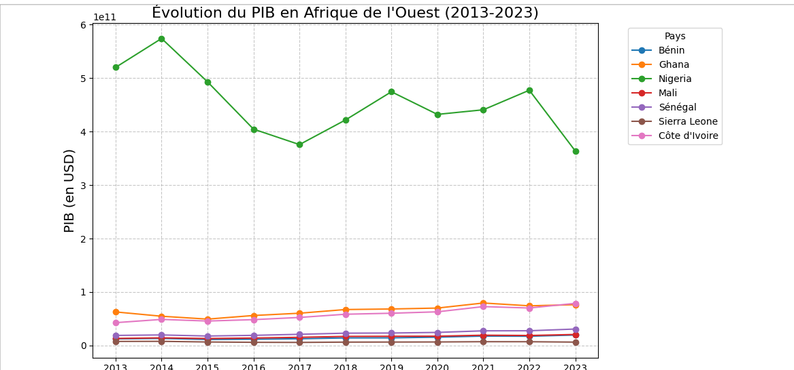
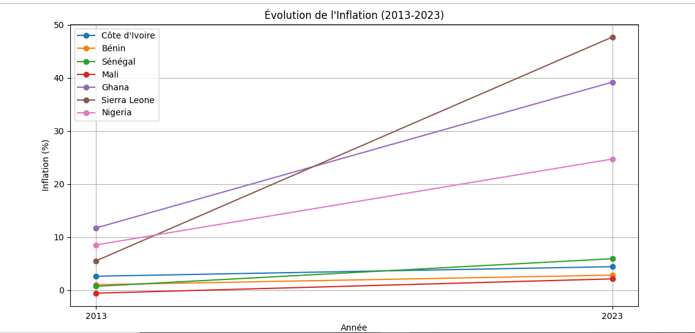

# Analyse du PIB et de l'Inflation en Afrique de l'Ouest

## Objectif
Ce projet analyse l'évolution du PIB et de l'inflation dans plusieurs pays d'Afrique de l'Ouest entre 2013 et 2023.

## Données Utilisées
- **Source** : Banque Mondiale (PIB) et FMI (Inflation).
- **Pays** : Côte d'Ivoire, Sénégal, Ghana, Nigeria, Sierra Leone, Mali, Bénin.
- **Période** : 2013-2023.

## Graphiques
### Évolution du PIB

### Évolution de l'Inflation

## Code
Le code utilisé pour générer les graphiques est disponible dans le notebook Jupyter : [analyse_pib_inflation.ipynb](analyse_pib_inflation.ipynb).
